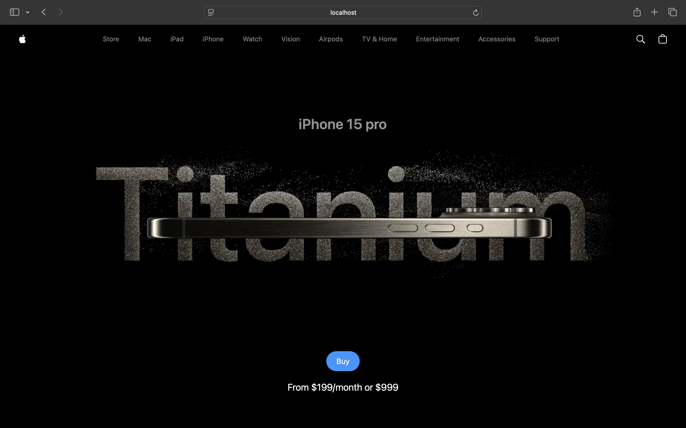
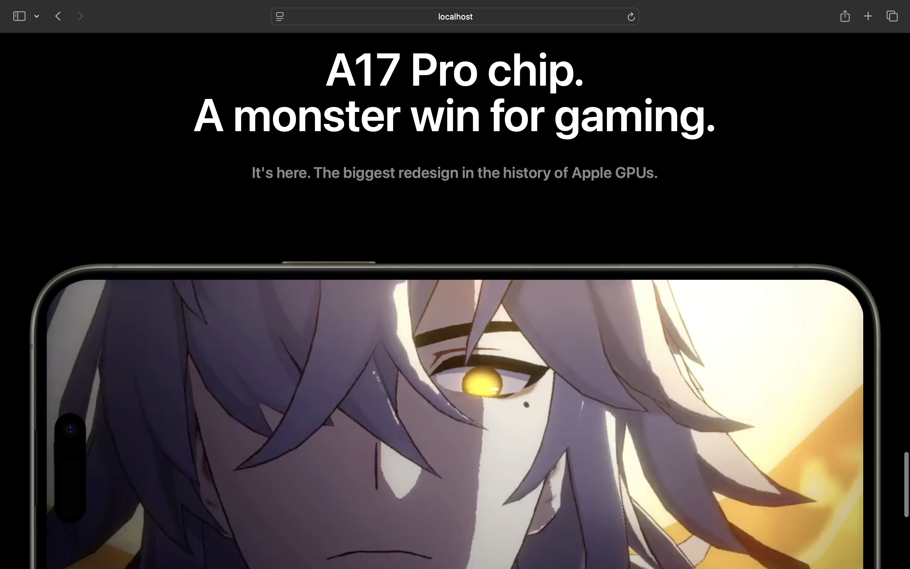
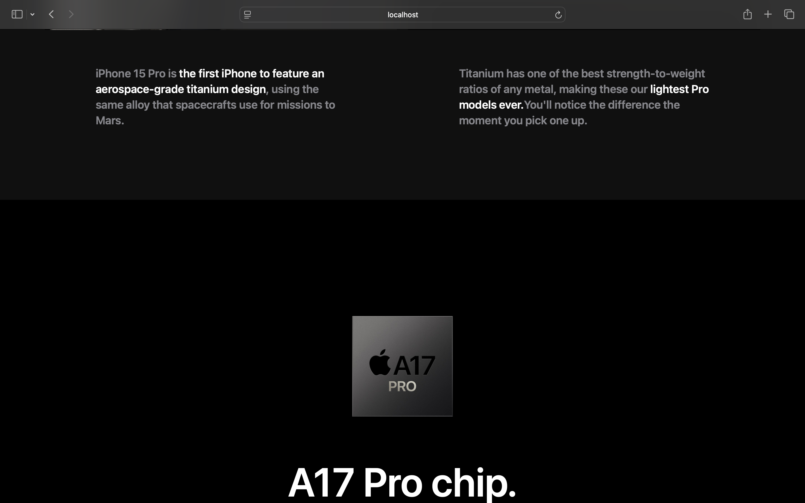
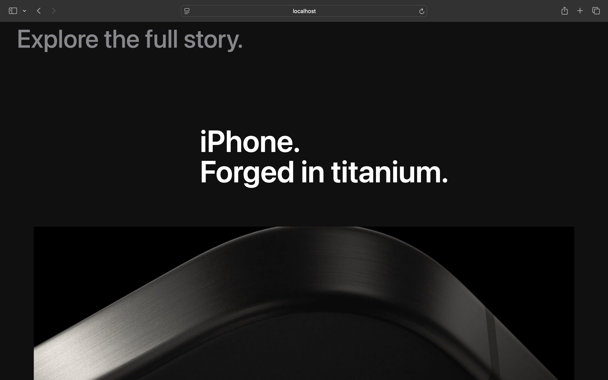
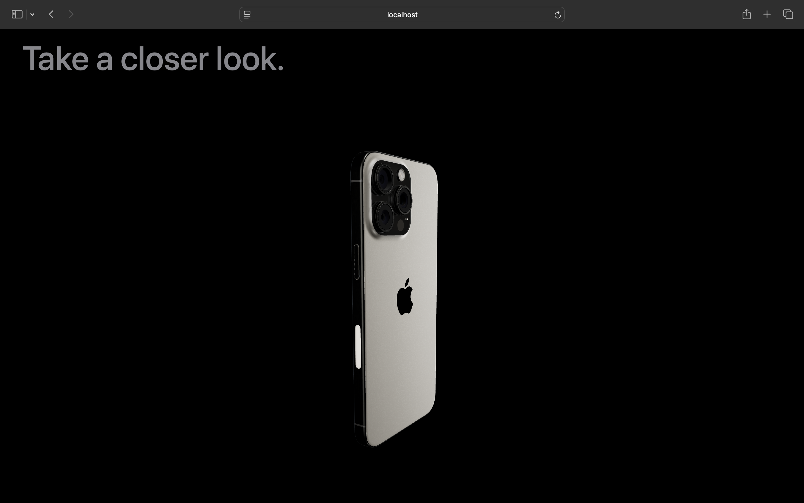
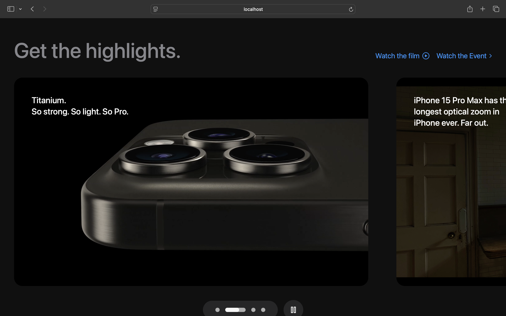

# 🍏 Apple-Themed Website

An immersive and visually stunning Apple-themed website that leverages modern animations and design principles to deliver a clean, elegant, and user-friendly experience.

---

## 🌟 Project Overview

This project is designed to showcase Apple-inspired aesthetics using advanced animation libraries and modern frontend tools. The website features dynamic animations, interactive 3D elements, and a minimalist design approach to bring out the sophistication associated with Apple products.

Here’s a sneak peek at the Apple-themed website’s UI. Each section highlights the smooth animations, clean layout, and 3D elements.

|  |  |  |
|------------------------------------------|------------------------------------------|------------------------------------------|
|  |  |  |

---

## 🛠 Tech Stack

This project is built with the latest tools in frontend development to achieve a seamless and responsive user experience.

     

---

## ✨ Features

- **Smooth Animations**: Implemented with GSAP for seamless, high-performance animations.
- **3D Model Integration**: Utilized Three.js to incorporate interactive 3D Apple products.
- **Responsive Design**: Styled with Tailwind CSS for a responsive, mobile-friendly experience.
- **High Performance**: Built with Vite for fast bundling and optimized performance.

---

## 📅 Future Improvements

- **User Interactivity Enhancements**: Add more interactive elements to enrich the user experience.
- **SEO Optimization**: Implement SEO best practices to improve search engine rankings.
- **More 3D Models**: Experiment with additional Apple product models for a more comprehensive showcase.

---
## 📬 Contact

Feel free to reach out if you’re interested in collaborating or learning more about this project!

 

---

